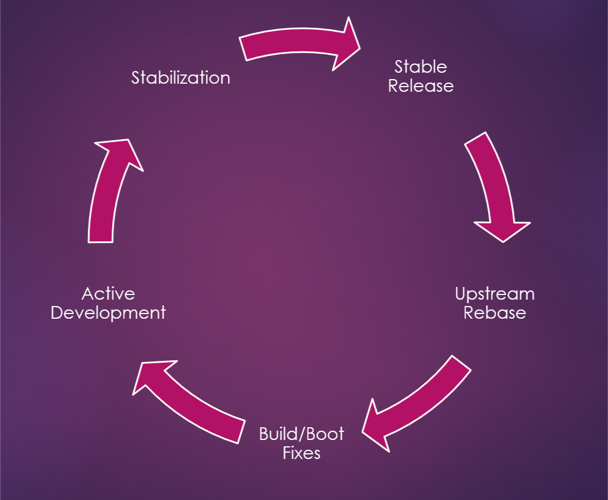
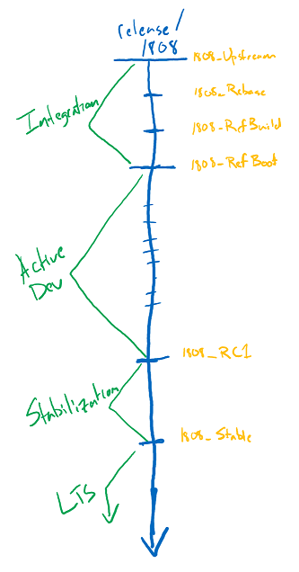

## Overview

!!! warning "Contents and Process Under Active Development"
    The basics of this process are identical to those followed by the Project Mu firmware integration and release process internal to Microsoft, but the formal documentation, branch naming, and tagging process is a work in progress. While this is how we expect things to work, there may be changes within the the first few releases driven by feedback within the team and any external consumers/contributors.

In the interest of maintaining a close, well-defined relationship with the upstream project, TianoCore, the active release branch of Project Mu is periodically deprecated and all Mu-related changes are rebased onto a selected commit of TianoCore. This keeps Project Mu up to date with TianoCore while highlighting all Project Mu differences in the most recent commits and encouraging the reverse integration of all changes/fixes back into TianoCore

In general, the life-cycle of active code follows the following path:

All active work in Project Mu is performed on a `release/*` branch, named sequentially according to the date of TianoCore commit that it's based on (e.g. `release/201808` is based on the `edk2-stable201808` branch in TianoCore). Work proceeds on that branch until a new TianoCore integration is targeted, at which point a new branch is created and all existing changes are rebased onto the new branch and the new branch is used for all active development going forward. At this point, the previous branch enters a stabilization period where further tests are performed and only bug fixes are allowed to be committed. After stabilization, the branch is labeled as `stable` and will only receive critical bug fixes either directly to the branch or backported from a more recent release.

`release/*` branches will be maintained in LTS (Long-Term Support) for at least the next two releases.

The below diagram illustrates the life-cycle of a single branch and indicates the critical points in its lifetime. These critical points will be applied as tags for reference and documentation. The tags are given a name relative to the target branch and consist of: Upstream base, Rebase complete, Rebase builds, Rebase boots, RCn, and Stable. These tags are discussed in more detail below.

!!! danger "Important"
    Due to the impacts of the rebase process on the history of Mu release branches, any downstream consumers will have to follow a similar integration process when upgrading to a new release. Any custom changes made within the Project Mu repos will have to be rebased from one release to the next.
    
    This is why we strongly discourage forking Project Mu for direct modification (ie. consumption, not contribution). Instead, leverage the distributed repo management system and override management system to integrate proprietary code/modules.

## Upstream Integration Phase

At this time, we are targeting upstream integrations for roughly once a quarter, attempting to align 1:1 with the TianoCore stable release cadence. Prior to an integration, the status dashboard (not yet created) will be updated with the target date of completion and the target TianoCore commit and/or release. For example, a plan was made to transition off of `release/20180529` when TianoCore announced the `edk2-stable201808` release.

Once a commit is selected, a set of rebase commits will be chosen from the active (previous) `release/*` branch. Ideally, these commits would include everything from the previous rebase through the most recent `*_RC` tag. For example, when moving from the `release/201808` branch, the commits will be selected from `1808_Upstream` (not inclusive) tag to `1808_RC1`.

After selection, this list of commits will be evaluated to determine whether any changes are no longer needed in the Mu history. The most likely causes of this action are:

* A change was submitted to TianoCore and has been accepted since the last rebase. Therefore, the change is no longer needed in Mu history.
* A change was reverted or modified more recently in Mu history, and the history of this change was squashed to maintain simplicity when comparing with upstream (TianoCore).

Once all evaluation is completed, the rebase will be performed in the new `release/*` branch. This branch will then be built for a reference platform (to be selected by internal team) and booted, at which point it will be considered the active development branch.

### Integration Milestone Tags

During integration, multiple tags are applied to the branch to serve as milestones. They also serve as reference point for changelog documentation that is produced during the integration process. These tags are described below:

* `*_Upstream`
    * This tag is placed on the exact TianoCore commit that a given release branch started from. This is used as a reference point between branches and relative to the rebase operation. The documentation produced for this tag contains the differences in TianoCore between this branch and the previous branch. For branches that originated from TianoCore releases, this changelog should be identical to the TianoCore changelog.
* `*_Rebase`
    * This tag is placed on the commit at the branch HEAD once the rebase is completed. The only changes to the commits from the last branch should be merge conflict resolutions and any history simplification as described above. The documentation produced for this tag contains a record of these resolutions and simplifications.
* `*_RefBuild`
    * This tag is placed on the commit where a reference platform consuming a large portion of the Mu code can successfully build. The documentation produced for this tag contains any changes required to get the reference platform building. It includes a list of changes outside the Mu project that are recommended for any consuming platform.
* `*_RefBoot`
    * This tag is placed on the commit where a reference platform consuming a large portion of the Mu code can successfully boot. The documentation produced for this tag contains any changes required to get the reference platform booting. It includes a list of changes outside the Mu project that are recommended for any consuming platform.

In each of these cases, the `*` will be replaced with a corresponding branch name. For example, the tags associated with `release/201808` will be prefixed with `1808` (e.g. `1808_Rebase`, `1808_RC1`, etc.).

## Active Development Phase

During the active development phase, the release branch is open for comment and contribution both internally and publicly. All work contributed by the Project Mu team will be publicly available after an internal PR review. This commits will automatically be mirrored to the public repos. Similarly, all completed public PRs are mirrored in internal review repos (with preference being given to the public PR in event of a conflict). While this means that there will be times where Project Mu team will make contributions without going through a full public PR review, all code is open to comment and contribution, up to and including a full revert of the internal Mu team contribution.

### Public Contribution/Commentary

For information on the contribution policies and steps, see the [How to Contribute](/How/contributing) document.

### Upstream Cherry-Picks

In the event that a critical change is made in the TianoCore upstream during the Active Development phase, the Project Mu team (with any suggestions or comment from downstream contributors) will evaluate the change for a mid-release cherry pick. If warranted, the commit(s) will be cherry-picked directly from TianoCore and prefixed with a "CHERRY-PICK" tag in the commit message so they can be cleaned up in the next rebase.

## Stabilization Phase

When warranted, active development on the active `release/*` branch will be halted so that it may enter a period of rigorous testing and stabilization. Upon entering the Stabilization phase, the branch will be tagged with a `*_RC1` tag and only bug fixes will be accepted from then on. Any defects or regressions found during stabilization will be fixed and documented. Once confidence is built in the stability of the code, the branch will be tagged as `*_Stable` and it will enter LTS.

It is Project Mu's goal that this cadence be aligned with the TianoCore release cadence, with the previous branch stabilizing at the same time a new TianoCore release is available. In this way, development can seamlessly move to the next `release/*` branch without lapse in availability.

!!! note
    It is possible that the `*_RC1` tag be applied to the same commit as `*_Stable` if there are no defects found in the branch. (Because that happens all the time.)

    It is also possible that multiple `*_RCn` tags may be useful to distinguish between milestones of a particularly protracted Stabilization phase.

### Transition Branches

In the event that it becomes necessary to stabilize a `release/*` branch prior to the availability of a suitable TianoCore commit for rebasing, all active development will move to a `dev/*` branch that will branch from the previous `*_RC1` tag. If bugs are discovered in the Stabilization phase for the `release/*` branch, they will also be fixed in the `dev/*` branch and all changes made in the `dev/*` branch will be rebased as part of the next `release/*` branch when it is ready.

### Long-Term Support (LTS)

It is Project Mu's goal that all `release/*` branches continue to be maintained with active bug fixes -- as necessary -- for at least two full releases after the branch becomes stable.

## Lifetime of a Single Integration

***TBD***
