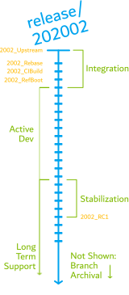

# Release Process

## Overview

!!! warning "Contents and Process Under Active Development"
    While we've been using this process for a couple of years now and think we've worked out all the kinks, it
    is still subject to change at any time and evolve with our relationship to the upstream project as well as
    requests and requirements from our downstream consumers and the community.

In the interest of maintaining a close, well-defined relationship with the upstream project, TianoCore, the active
release branch of Project Mu is periodically deprecated and all Mu-related changes are rebased onto a selected commit
of TianoCore. This keeps Project Mu up to date with TianoCore while highlighting all Project Mu differences in the
most recent commits and encouraging the reverse integration of all changes/fixes back into TianoCore.

In general, the life-cycle of active code follows the following path:

<center></center>

All active work in Project Mu is performed on a `release/*` branch, named sequentially according to the date of
TianoCore commit that it's based on (e.g. `release/201808` is based on the `edk2-stable201808` branch in TianoCore).
Work proceeds on that branch until a new TianoCore integration is targeted, at which point a new branch is created and
all existing changes are rebased onto the new branch and the new branch is used for all active development going
forward. At this point, the previous branch enters a stabilization period where further tests are performed and only
bug/security fixes are allowed to be committed. Once in stabilization, the branch will receive a Release Candidate tag
(like `2002_RC1`) to provide synchronization across all Mu repos and represents releases of the code that has been
tested and is known to work together.

`release/*` branches will be maintained in LTS (Long-Term Support) for at least the next two releases (though it may be
longer based on community needs). Once LTS has ended, the branch will be archived following the process described
[below](#post-lts-and-archiving).

<center></center>

The below diagram illustrates the life-cycle of a single branch and indicates the critical points in its lifetime.
These critical points will be applied as tags for reference and documentation. The tags are given a name relative
to the target branch and consist of: Upstream base, Rebase complete, Rebase builds and passes CI, Rebase boots on
a designated reference platform, and stabilized Release Candidates.
These tags are discussed in more detail [below](#integration-milestone-tags).

<center>

</center>

!!! danger "Important"
    Due to the impacts of the rebase process on the history of Mu release branches, any downstream consumers will have
    to follow a similar integration process when upgrading to a new release. Any custom changes made within the Project
    Mu repos will have to be rebased from one release to the next.  
    This is why we **strongly discourage** forking Project Mu for direct modification (ie. consumption, not contribution).
    Instead, leverage the distributed repo management system and override management system to integrate proprietary
    code/modules.

## Current Branch Status

The status of each branch will be recorded in the ReadMe.rst file at the root of the branch. In general, the
ReadMe found in Basecore will contain information that is common to all of the Mu submodules, but each submodule will
also have its own ReadMe for each release branch that contains notes specific to the development that occurs in that
submodule during a release cycle.

The ReadMe will also contain a summary of the branch status at a given time. For example, here is a sample status for
Basecore `release/202008` as of the time of this writing:

``` pre
:Status:
  In Development

:Entered Development:
  2020/09/23

:Anticipated Stabilization:
  November 2020
```

In addition, the ReadMe.rst file contains information related to the target upstream commit ("Destination commit") for
the current integration as well as the final commit ("Source commit") from the previous `release/*` branch when the
integration commenced.

## Upstream Integration Phase

At this time, we are targeting upstream integrations for roughly once a quarter, attempting to align 1:1 with the
TianoCore stable release cadence. Prior to an integration, the Project Mu Teams channel will be updated with the
target date of completion and the target TianoCore commit and/or release. For example, a plan was made to
transition off of `release/20180529` when TianoCore announced the `edk2-stable201808` release.

Once a commit is selected, a set of rebase commits will be chosen from the active (previous) `release/*` branch.
Ideally, these commits would include everything from the previous rebase through the most recent `*_RC` tag. For
example, when moving from the `release/201808` branch, the commits will be selected from `1808_Upstream`
(not inclusive) tag to `1808_RC1`.

After selection, this list of commits will be evaluated to determine whether any changes are no longer needed in the
Mu history. The most likely causes of this action are:

* A change was submitted to TianoCore and has been accepted since the last rebase. Therefore, the change is no longer
  needed in Mu history.
* A change was reverted or modified more recently in Mu history, and the history of this change was squashed to
  maintain simplicity when comparing with upstream (TianoCore).

Once all evaluation is completed, the rebase will be performed in the new `release/*` branch. This branch will then be
submitted for the same CI/PR gates that any commit would be required to pass to ensure that there have been no regressions
and to guarantee that dev work can transition to the new branch. Finally, the new release branches will be integrated
into a designated reference platform and porting notes will be written in the ReadMe.rst file describing any known
breaking changes.

Once all these milestones have been passed, the new `release/*` branch will be made the default branch for all repos
and the old branch will enter a brief stabilization period before receiving an `*_RC` tag.

### Integration Milestone Tags

During integration, multiple tags are applied to the branch to serve as milestones. They also serve as reference point
for changelog documentation that is produced during the integration process. Not all repos will have all tags, because
not all repos have an upstream. These tags are described below:

<!-- markdownlint-disable MD007 -->
<!-- For some reason, mkdocs wants 4 and markdownlint wants 2 -->
* `*_Upstream`
    * This tag is placed on the exact TianoCore commit that a given release branch started from. This is used as a
    reference point between branches and relative to the rebase operation. The documentation produced for this tag
    contains the differences in TianoCore between this branch and the previous branch. For branches that originated
    from TianoCore releases, this changelog should be identical to the TianoCore changelog. (Does not exist on all
    repos.)
* `*_Rebase`
    * This tag is placed on the commit at the branch HEAD once the rebase is completed. The only changes to the commits
    from the last branch should be merge conflict resolutions and any history simplification as described above. The
    documentation produced for this tag contains a record of these resolutions and simplifications. (Does not exist on
    all repos.)
* `*_CIBuild`
    * This tag is placed on the commit where all code in the given repo passes all CI/PR checks that would normally
    be required of any commit to the branch. These checks include comprehensive compilation checks as well as things
    like: spelling, library declarations, code format, etc. The documentation produced for this tag contains any changes
    required to pass these checks.
* `*_RefBoot`
    * This tag is placed on the commit where a reference platform consuming a large portion of the Mu code can
    successfully boot. The documentation produced for this tag contains any changes required to get the reference
    platform building and booting. It includes a list of changes outside the Mu project that are recommended for
    any consuming platform.
<!-- markdownlint-enable MD007 -->

In each of these cases, the `*` will be replaced with a corresponding branch name. For example, the tags associated
with `release/201808` will be prefixed with `1808` (e.g. `1808_Rebase`, `1808_RC1`, etc.).

## Active Development Phase

During the active development phase, the release branch is open for comment and contribution both internally and
publicly. All work contributed by the Project Mu team will be publicly available after an internal PR review. These
commits will automatically be mirrored to the public repos. Similarly, all completed public PRs are mirrored in
internal review repos (with preference being given to the public PR in event of a conflict). While this means that
there will be times where Project Mu team will make contributions without going through a full public PR review, all
code is open to comment and contribution, up to and including a full revert of the internal Mu team contribution.

### Public Contribution/Commentary

For information on the contribution policies and steps, see the [How to Contribute](/How/contributing) document.

### Upstream Cherry-Picks

In the event that a critical change is made in the TianoCore upstream during the Active Development phase, the Project
Mu team (with any suggestions or comment from downstream contributors) will evaluate the change for a mid-release
cherry pick. If warranted, the commit(s) will be cherry-picked directly from TianoCore using the `-x` parameter so
that it is obvious which upstream commit corresponds to the cherry-pick. This is for provenance as well as ensuring
that these commits are cleaned up on the next integration.

## Stabilization Phase

Once active development has moved off of a given `release/*` branch, the branch will undergo a period of stabilization
where no major changes will be made while additional hours are gained and -- potentially -- additional tests are run.
Once sufficient confidence is built, the branch will be tagged with an `*_RC1` tag. Only major bug fixes and features
that have reached community consensus will be accepted from then on.

It is Project Mu's goal that this cadence be aligned with the TianoCore release cadence, with the previous branch
stabilizing at the same time a new TianoCore release is available. In this way, development can seamlessly move to the
next `release/*` branch without lapse in availability.

!!! note
    It is possible that multiple `*_RCn` tags may be useful to distinguish between milestones of a particularly
    protracted Stabilization phase, or if major issues were found after the initial `*_RC` tag. If this occurs,
    the ReadMe.rst file will be updated with the motivation behind the extra release. It should also be noted that
    this will cause a new release across all the Project Mu repos to confirm that the code has been tested together.
    As a result, there may exist a single commit with multiple `*_RC` tags.

### Transition Branches

In the event that it becomes necessary to stabilize a `release/*` branch prior to the availability of a suitable
TianoCore commit for rebasing, all active development will move to a `dev/*` branch that will branch from the previous
`*_RC1` tag. If bugs are discovered in the Stabilization phase for the `release/*` branch, they will also be fixed in
the `dev/*` branch and all changes made in the `dev/*` branch will be rebased as part of the next `release/*` branch
when it is ready.

### Long-Term Support (LTS)

It is Project Mu's goal that all `release/*` branches continue to be maintained with active bug fixes
-- as necessary -- for at least two full releases after the branch becomes stable. The Project Mu team will serve as
the primary deciding body for whether a bug fix to the current `release/*` branch merits porting back to the prior two
branches, but community input or suggestions are always welcome.

All release branches that make it to the Stabilization phase will be hosted and kept in the repository in perpetuity.
If any change was required to this policy (perhaps for server considerations), the branches will remain archived for
posterity and should be available by request.

### Post-LTS and Archiving

LTS branch maintenance requires significant resources, both to human (to manually curate and port critical fixes, as
well as documentation) and computational (to run regular CI on all active branches across all repos). As such, while
we try to keep these branches stable and active for as long as possible, we cannot do it forever.

To uphold our commitment to persist any branch that makes it to the LTS phase, these branches will instead be
"archived". Prior to archival, a notice will be posted to the Project Mu Teams channel announcing the planned dates.
The actual process for archiving on the server is:

1. Create a new branch under the `archived/*` namespace at the exact commit of the existing branch.
    * `release/202008` --> `archived/release/202008`
2. Push this new branch to the server.
3. Delete the old branch on the server.

This process is repeated across all Mu repos. Since the commit history always has a Git branch referencing it, all
of the commits will be preserved and any projects that are currently consuming the commit will continue to function
as expected.

However, after this point the branch will receive no further updates and all consumers are encouraged to move to one
of the active LTS branches.
