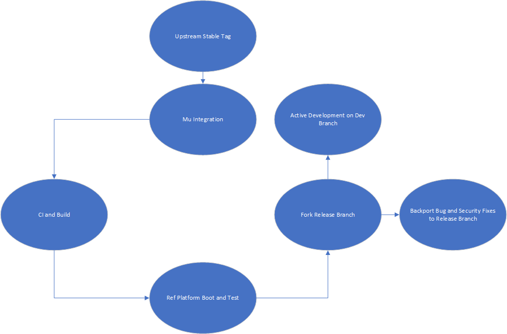
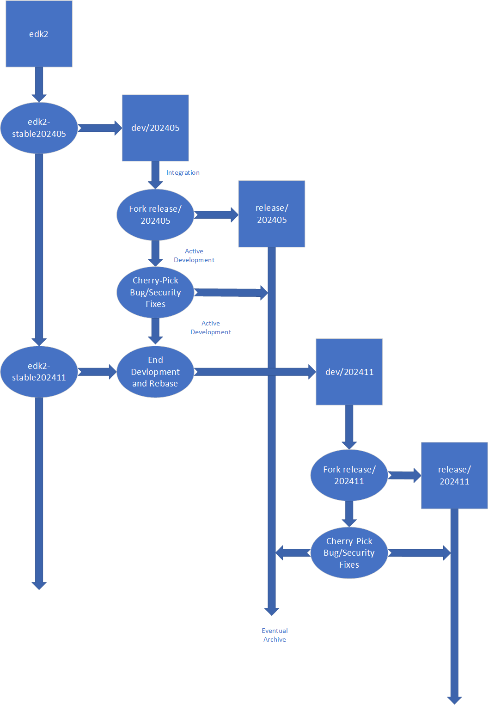

# Release Process

## Overview

!!! warning "Contents and Process Under Active Development"
    While we've been using this process for a couple of years now and think we've worked out all the kinks, it
    is still subject to change at any time and evolve with our relationship to the upstream project as well as
    requests and requirements from our downstream consumers and the community.

Project Mu carries a set of changes that are made on top of a given release of its upstream project,
[TianoCore](https://www.tianocore.org/). Project Mu follows a release-based branching model with the Mu release
corresponding to a release from the [edk2 repository](https://github.com/tianocore/edk2) in the TianoCore project.

edk2 follows a [quarterly release cadence](https://github.com/tianocore/tianocore.github.io/wiki/EDK-II#stable-tags)
with releases referred to as ["stable tags"](https://github.com/tianocore/edk2/tags). Therefore, a given Project Mu
release branch will be named according to the stable tag it is based upon - for example, `"release/202405"` means that
the Project Mu branch is based on the edk2 stable tag [`edk2-stable202405`](https://github.com/tianocore/edk2/releases/tag/edk2-stable202405).

The release branch process keeps Project Mu up to date with TianoCore while highlighting all Project Mu differences in
the most recent commits and encouraging the reverse integration of all changes/fixes back into TianoCore. It is worth
noting that an effort is made to contribute relevant changes to edk2 when they are created, however, a small number of
Project Mu changes are not intended to go to edk2.

In general, the life-cycle of active code follows the following path:

  

> Note: The Project Mu development process changed in the `202405` timeframe with the goal to make the content consumed
  by Project Mu users more stable. This is accomplished by splitting the content into two branches - a "development"
  branch where developers contribute all changes during this release cycle (e.g. the `202405` release cycle) and a
  "release" branch which only picks up bug fixes and critical changes during this time.

## Development vs Release Branches

When a new Project Mu release is started from an edk2 release, a new Mu development branch is created. For example, if
the edk2 stable tag is `edk2-stable202405`, then a `dev/202405` branch will be created. The initial content consists
of the commits from the `edk2-stable202405` stable tag with any Project Mu exclusive commits carried over from the
previous dev branch on top. Until the next release, all active work in Project Mu would be performed on the
`dev/202405` branch.

Continuing the example, the `release/202405` release branch is forked off from the `dev/202405` branch when the branch
content is considered stable. Moving forward, only bug and security fixes will be backported to the release branch in
order to maintain its stability. All downstream consumers should always consume from the release branch, unless they
are testing out new functionality only present in the dev branch. Project Mu will continue back porting bug and security
fixes to release branches as part of LTS (Long-Term Support) for at least the next two releases (though it may be
longer based on community needs). Once LTS has ended, the releae branch will be archived following the process described
[below](#post-lts-and-archiving). It is then a choice of the downstream consumer on when to upgrade release
branches; this may be at a regular cadence or may stop after shipping a platform. For example. downstream consumers must
be aware that changing between release branches will introduce a set of breaking changes and new functionality, which
must be reviewed and accommodated for in the platform by reviewing the release notes on GitHub for the new release
branch (e.g. these are the [release notes](https://github.com/microsoft/mu_basecore/releases/tag/v2024050000.0.0) for
the first release of `release/202405`).

All new commits to `release/*` branches are in the form of cherry-picks from the associated `dev/*` branch. Because
of diverging history, these commits may be in a slightly different form in the release branch than in the dev branch.

Project Mu makes use of GitHub releases to indicate which set of commits in the release branch downstream consumers
should move between. Release notes are generated for each Github release that explain the changes between releases and
make note of any special integration instructions.

Breaking changes **will not** be introduced to `release/*` branches after the initial fork except as where required by
a bug or security fix. It is recommended that downstream consumers move regularly to the most recent release of the
`release/*` branch they are on to gain important fixes.

!!! danger "Important"
    Due to the impacts of the rebase process on the history of Mu release branches, any downstream consumers will have
    to follow a similar integration process when upgrading to a new release. Any custom changes made within the Project
    Mu repos will have to be rebased from one release to the next.
    This is why we **strongly discourage** forking Project Mu for direct modification (ie. consumption, not contribution).
    Instead, leverage the distributed repo management system and override management system to integrate proprietary
    code/modules.

## Current Branch Status

The status of each branch will be recorded in the ReadMe.rst file at the root of the branch. In general, the
ReadMe found in Basecore will contain information that is common to all of the Mu submodules, but each submodule will
also have its own ReadMe for each release branch that contains notes specific to the development that occurs in that
submodule during a release cycle.

The comprehensive view of what is new in a given Project Mu release is available by comparing it against an older
release in GitHub. For example, [here](https://github.com/microsoft/mu_basecore/compare/v2024050000.0.0...v2024050000.0.1)
is the comparison of two `release/202405` commits. For a higher level view with integration instructions and breaking
change notices, refer to the [release notes](https://github.com/microsoft/mu_basecore/releases/tag/v2024050000.0.1).

## Upstream Integration Phase

Upstream integrations with TianoCore are done on as needed basis, typically every other stable release, with needed
changes being cherry-picked into Project Mu as required before that point. Github notifications on Project Mu releases
are the centralized way to follow new releases, both within a release branch and for a new release branch.

Once an edk2 stable tag is chosen, the `dev/*` branch will be selectively rebased to determine whether any changes are
no longer needed in Mu history. The most likely causes of this action are:

* A change was submitted to TianoCore and has been accepted since the last rebase. Therefore, the change is no longer
  needed in Mu history.
* A change was reverted or modified more recently in Mu history, and the history of this change was squashed to
  maintain simplicity when comparing with upstream (TianoCore).

The `dev/*` branch is rebased onto the new edk2 stable tag, creating a new `dev/*` branch (e.g. `dev/202405` will have
commits taken from it and rebase on `edk-stable202411` to create `dev/202411`). The `release/*` branch will not be
moved forward and a new `release/*` branch will be forked from the new `dev/*` branch when stabilization is declared.

The final step is to integrate the new release branch with the reference virtual platforms in
[mu_tiano_platforms](https://github.com/microsoft/mu_tiano_platforms) to ensure OS boot and other functional and audit
tests succeed.

After transitioning to the new `dev/*` branch on the edk2 stable tag, the old `dev/*` branch will not be maintained,
only older `release/*` branches, per community need, will be kept up to date with bug and security fixes.

## Active Development Phase

During the active development phase, the `dev/*` branch is open for comment and contribution both internally and
publicly. All work contributed by the Project Mu team will be publicly available immediately, as all dev work is done
directly in GitHub.

### Public Contribution/Commentary

For information on the contribution policies and steps, see the [How to Contribute](/How/contributing) document.

### Upstream Cherry-Picks

In the event that a critical change is made in the TianoCore upstream during the Active Development phase, the Project
Mu team (with any suggestions or comment from downstream contributors) will evaluate the change for a mid-release
cherry pick. If warranted, the commit(s) will be cherry-picked directly from TianoCore with `[CHERRY-PICK]` in the
commit title, to indicate that this came from TianoCore out of cycle with the stable tags.

## Stabilization Phase

All `release/*` branches, starting with `release/202405` are considered stable, while all `dev/*` branches are
considered active development.

### Long-Term Support (LTS)

It is Project Mu's goal that all `release/*` branches continue to be maintained with active bug fixes
-- as necessary -- for at least two full releases after the branch becomes stable. The Project Mu team will serve as
the primary deciding body for whether a bug fix to the current `release/*` branch merits porting back to the prior two
branches, but community input or suggestions are always welcome.

### Post-LTS and Archiving

LTS branch maintenance requires significant resources, both to human (to manually curate and port critical fixes, as
well as documentation) and computational (to run regular CI on all active branches across all repos). As such, while
we try to keep these branches stable and active for as long as possible, we cannot do it forever.

To uphold our commitment to persist any branch that makes it to the LTS phase, these branches will instead be
"archived". Prior to archiving a `release/*` branch, a GitHub discussion will be created in
[mu_basecore](https://github.com/microsoft/mu_basecore/discussions) announcing the dates of archival and soliciting
community feedback for need to keep this branch actively maintained.

The actual process for archiving on the server is:

1. Create a new branch under the `archived/*` namespace at the exact commit of the existing branch.
    * `release/202405` --> `archived/release/202405`
2. Push this new branch to the server.
3. Delete the old branch on the server.

This process is repeated across all Mu repos. Since the commit history always has a Git branch referencing it, all
of the commits will be preserved and any projects that are currently consuming the commit will continue to function
as expected.

However, after this point the branch will receive no further updates and all consumers are encouraged to move to one
of the active LTS branches.
