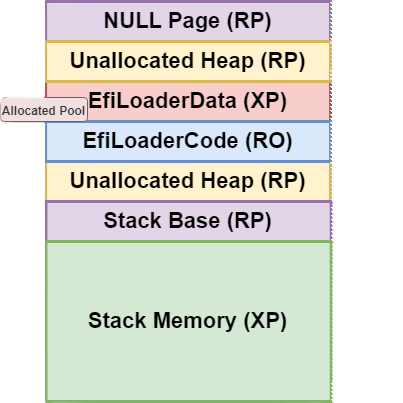
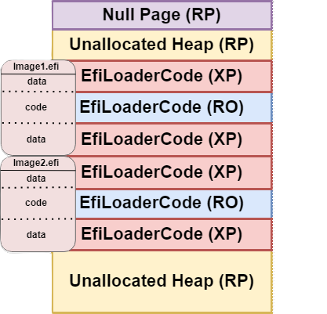

# Enhanced UEFI Memory Protection

## Background

While considerable attention has been devoted to hardware trust anchors and operating
system security, attackers have discovered that UEFI firmware is lacking basic memory
protection that has been present in other system software for over a decade. Coupled
with the inconsistency of security capabilities inherent to vendor firmware implementations,
UEFI firmware has become an increasingly attractive system attack vector. Exploiting
firmware vulnerabilities can be especially rewarding for an attacker because they can
compromise hypervisor-based technologies such as Virtualization Based Security (VBS)
and be used to establish boot kits that subvert antivirus and malware detection software
in the operating system.

In response to these security concerns, Microsoft is recommending all UEFI platform
vendors implement strict memory protections (these may become a requirement in the
future). This page describes the Enhanced Memory Protections that Microsoft is
recommending UEFI vendors implement.

These enhanced protections will cause some compatibility challenges, but the
more consistent our ecosystem is, the faster it will be to get the extensible
parts of our ecosystem aligned. The closing section in this document addresses
compatibility mitigations (Compatibility Mode) to handle non-compliant
modules during this transition period. It will take time for legacy code
to be updated to adhere to these new requirements and our collective commitment
to progress will pave the way to a more secure and resilient digital future.
**Project Mu serves as a reference implementation for Enhanced Memory Protections.**

## Terminology

This document describes two states of memory protections: hardware state and
software state. The hardware state is the state of the page table and the software
state is the state of the Global Coherency Domain (GCD). These states need to
be in sync with each other, but different architectures may implement the
mapping from GCD state to page table state differently. This document uses the
GCD terminology as it is universal. This section serves to define the expectations
that this document makes when using the GCD terminology.

| Attribute                     | Description                                                              |
|-------------------------------|--------------------------------------------------------------------------|
| `EFI_MEMORY_XP`               | Memory is non-executable.                                                |
| `EFI_MEMORY_RO`               | Memory is read-only.                                                     |
| `EFI_MEMORY_RP`               | Memory is read-protected or unmapped. A CPU fault occurs if accessed.    |

## Condensed Requirements List

1: All memory available to the platform must be described in the GCD.
2: No address range can be simultaneously readable, writable, and executable. This means every GCD entry must have at
least one of EFI_MEMORY_XP, EFI_MEMORY_RO, or EFI_MEMORY_RP set.
3: Loaded image sections marked with the data characteristic must be EFI_MEMORY_XP.
4: Loaded image sections marked with the code characteristic must be EFI_MEMORY_RO.
5: PE Loaders must check the NX_COMPAT flag of loaded images to determine
compatibility with the above memory protection requirements.
6: MMIO ranges must be marked EFI_MEMORY_XP.
7: Unallocated memory must be marked EFI_MEMORY_RP.
8: Address space which is not present in the Global Coherency Domain must cause a
CPU fault if accessed.
9: Calls to EFI_BOOT_SERVICES.AllocatePages and EFI_BOOT_SERVICES.AllocatePool
must return memory with the EFI_MEMORY_XP attribute.  
10: AP and BSP stacks must be marked EFI_MEMORY_XP.  
11: AP and BSP stacks must have an EFI_MEMORY_RP page at the bottom to catch overflow.
12: Page 0 in physical system memory must be marked EFI_MEMORY_RP.
13: The UEFI 2.10 Memory Attribute Protocol must be produced.  

## Expanded Requirements List

### All Memory is Described in the GCD

All memory that a platform can access, whether through MMIO, protocols like CXL, or directly attached, must be
described in the GCD with an appropriate memory type. The GCD is UEFI's software state of memory. If memory is not
described here, we cannot safely manage the security of that memory.

### No R/W/X Regions

This has been a system software requirement for decades at this point and should be self-explanatory. Self-modifying
executable regions are an easy attack vector for a bad actor. As such, all memory in the GCD must have one or more of
EFI_MEMORY_XP, EFI_MEMORY_RO, and EFI_MEMORY_RP set.

### Image Data Sections Must Be EFI_MEMORY_XP

Image data sections must be read from at a minimum and often need to be written to. They must not contain any
executable code. Executable code must be in an image section marked with the code characteristic. It is appropriate
to mark some image data sections EFI_MEMORY_RO in addition to EFI_MEMORY_XP, if they are read-only sections. All image
data sections must be marked EFI_MEMORY_XP to prevent execution from occurring from these regions. This is a requirement
to fulfill the No R/W/X Regions requirement and prevents common attack vectors for bad actors writing attack code to
a memory region and forcing the processor to execute it.

### Image Code Sections Must Be EFI_MEMORY_RO

Image code sections must be read and executed, but must not be writeable. This is a requirement to fulfill the No
R/W/X Regions requirement and prevents the same problem of bad actors editing a running drivers memory to cause it
to execute malicious code.

### MMIO Ranges Must Be EFI_MEMORY_XP

All devices connected to a system should be considered untrusted and must not be allowed to execute code. This is also
a common attack vector for a bad actor to connect a compromised device and force the host system to execute malicious
code from it.

### Unallocated Memory Must Be EFI_MEMORY_RP

This is a safety as well as security requirement. By marking unallocated memory EFI_MEMORY_RP, any access outside of
legitimately allocated memory will cause a CPU fault, catching a large set of buffer under/overflows and use-after-free
cases, which are both functional concerns as well as attack vectors.

This adds a new potential crash to code that may have "just worked" before, but it allows a platform to discover the
safety and security issues pre-production and enforces defined behavior where before there was undefined behavior.

### Memory Not in the GCD Must Cause a CPU Fault on Access

This is a converse of the requirement that all memory that a platform can access is described in the GCD: everything
else must, therefore, cause a fault when accessed, because it is not memory a platform can access.

### AllocatePages and AllocatePool Must Return Memory with EFI_MEMORY_XP

DXE Core cannot rely on drivers to set the correct attributes. Most memory allocations occur without the consumer
setting any attributes on the memory region. Furthermore, it is unsafe for pool allocations not in a multiple of the
EFI_PAGE_SIZE to attempt to set attributes, there are other consumers using this pool space. If the core does not set
the attributes, the attributes will not be set.

EFI_MEMORY_XP is the attribute that must be set because it is the general case: most memory will be marked
EFI_MEMORY_XP. Even memory that will be used for an image code section must be marked EFI_MEMORY_XP originally,
because the PE loader must write the code section to that memory before it marks it EFI_MEMORY_RO and removes
EFI_MEMORY_XP.

### AP/BSP Stacks Must Be EFI_MEMORY_XP

This continues the requirement that non-code sections must be marked EFI_MEMORY_XP. This closes a common attacker
scenario to put code on the stack and then force the processor to execute from it.

### AP/BSP Stacks Must Have EFI_MEMORY_RP Page at the Bottom

Commonly known as Stack Guard, this feature places a guard page marked EFI_MEMORY_RP at the bottom of the stack. This
catches stack overflows by causing a CPU fault if this guard page is read from or written to. Stack overflows are both
common attack vectors and common programming errors that require being caught during development.

This also adds a new potential crash during execution in code that may have "just worked" before, but similarly allows
these problems to be solved pre-production and enforces defined behavior instead of undefined.

### EFI Memory Attributes Protocol Must Be Installed

The Memory Attributes Protocol, added in UEFI spec 2.10, provides a method for bootloaders to interact with UEFI's page
tables before they create their own page tables. This allows them to enforce memory protections on their own images and
allocations, closing further attack vectors.

### PE Loaders Must Check the NX_COMPAT Flag for Compatibility

Many bootloaders and OPROMs will not have implemented support for enhanced protections on
image memory, allocated buffers, and other memory ranges. To indicate support for enhanced
protections, the PE/COFF IMAGE_DLLCHARACTERISTICS_NX_COMPAT DLL characteristic will be used.
Modules with this characteristic are expected to be compliant with enhanced memory protection
and should utilize the Memory Attribute Protocol to manipulate the attributes of memory they
allocate. If a module is loaded without this characteristic, the platform should enter
[compatibility mode](#compatibility-mode) if the platform chooses to support compatibility
mode.

Applying these page protections requires loaded images to meet the following criteria, signified by setting the
NX_COMPAT characteristic:

1. Section flags must not combine IMAGE_SCN_MEM_WRITE and IMAGE_SCN_MEM_EXECUTE for any
given section.
2. The PE image sections are aligned to page granularity.
3. The PE image must not contain any self-modifying code.

## Compatibility Mode

To provide a more consistent and predictable environment across UEFI implementations,
we are providing a definition for compatibility mode here. Errant modules and unexpected
faults blocking boot should enter compatibility mode which triggers the following
deviations from the enhanced memory protection definition:

1. All new memory allocated will be readable, writable, and executable.  
2. All images loaded from the start of compatibility mode will no longer have
restrictive access attributes applied to the memory ranges in which they are loaded.  
3. The Memory Attribute Protocol will be uninstalled.  
4. Page zero will be mapped if it resides in system memory.
5. Legacy BIOS memory (the lower 640K range) will be mapped as readable, writable, and
executable on AMD64 systems.

### A Note on User Notification of Compatibility Mode

When a system is in compatibility mode, it is important that the user receives some
notification during boot which could take the form of a dialogue box, color bar, or
other visual indicator. At the start of this journey toward more strict memory
protections, we believe how compatibility mode is visualized should be left up to the
platform. In the future, platform developers should consider adding a TPM (Trusted
Platform Module) measurement when the system enters compatibility mode to have platform
enforcement of memory protections.

## Additional Considerations

## Runtime Configurable Protections

To enable memory protection in consumer shipped devices, runtime
configurability options need to be present to respond to edge cases
and accommodate non-compliant option ROMs. It is up to the platform
developer to determine what levers will be available and how faults are handled.

## Exception Handling

Increasing the security posture of UEFI implementations will increase the
frequency of access violations. Exceptions should either cause a reset or
transition the memory protection state into compatibility mode. Platform
developers should also take care to ensure their exception handling logic
provides enough data to distinguish between fault types and root cause
failures. These access violations are often helpful for identifying programmer
errors and rooting out critical bugs before they become CVEs.

## Closing

It will take substantial work to update legacy code to adhere to these new security
standards. These protection mitigations offer significant value to end users by
heightening both real and perceived security, and to OEMs by reducing the number
of issues in the future. As we push toward updating incompatible modules, OEMs
should apply strict protections during product development which meet or exceed the
standard outlined in this document to help catch programmer error and reduce the
volume of unsafe firmware code entering the ecosystem. Microsoft is committed to
this effort and is prepared to work with partners as we move toward a more
secure UEFI ecosystem.

## Additional Resources

* [PE Format](https://learn.microsoft.com/windows/win32/debug/pe-format)
* [Requirements for 3rd Party Signing](https://learn.microsoft.com/windows-hardware/drivers/bringup/uefi-ca-memory-mitigation-requirements)
* [UEFI Paging Audit Tool](https://github.com/microsoft/mu_plus/tree/HEAD/UefiTestingPkg/AuditTests/PagingAudit)
