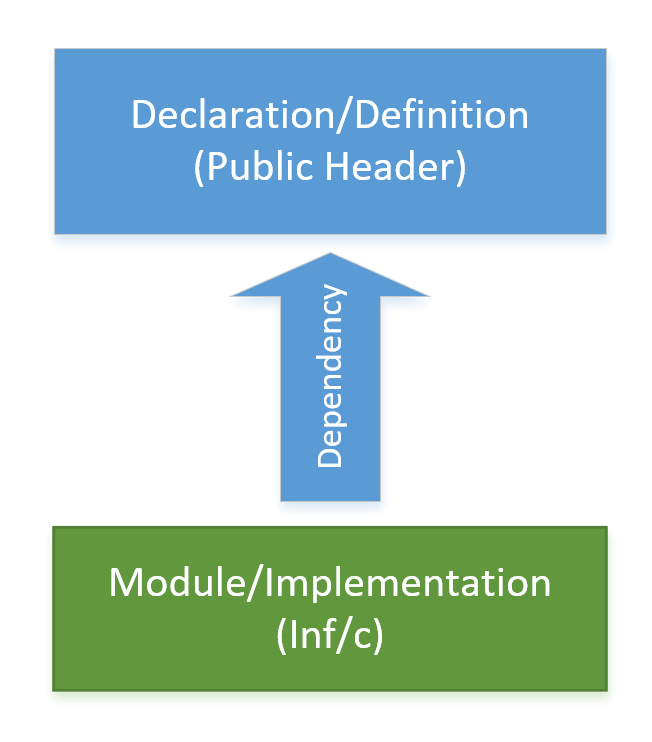

# Conceptual Layers

Today there is lots of types and sources of UEFI code in a full featured product.  
Some examples:

* TianoCore EDK2 UEFI standard based code
* TianoCore additional value add code
* Silicon Vendor code
* Silicon Vendor supplied value add code
* Independent BIOS Vendor code
* ODM/OEM Value add code
* OS firmware support code
* Legacy BIOS compatibility code
* Platform Code
* Board specific code
* etc

Then there is open source versions and closed source version.  There are overrides and bug fixes implemented by everyone across the stack.  Then there is bleeding edge vs last years version (or maybe 2 years ago).  Its no wonder that everyone does it differently.  Compound the version and source problem with the sheer size.  A common UEFI code base is generally well above 1 million LOC and only goes up from there.  

Clearly there are a lot of problem that can stem from this.  Project Mu is an attempt to bring some sanity to the issue by creating a rigid layering concept and aligning our partners.  Layering wont fix everything but its a start.

## What is a dependency

To understand the layering you must first understand the terminology.  There are two types of code assets.  

1. A definition of something.  Generally this is defined in a accessible header file.  This is the API provided by some asset.  This API can be "depended" on to provide some capability.  
2. A implementation of something.  Generally this is  A dependency is code that relies on a definition or prototype

