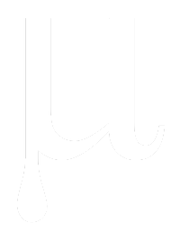

# Welcome to Project Mu

Project Mu is a modular adaptation of TianoCore's [edk2](https://github.com/tianocore/edk2) tuned for building modern devices using a scalable, maintainable, and reusable pattern.  Mu is built around the idea that shipping and **maintaining** a UEFI product is an ongoing collaboration between numerous partners.  For too long the industry has built products using a "forking" model combined with copy/paste/rename and with each new product the maintenace burden grows to such a level that updates are near impossible due to cost and risk.

Project Mu originated from building modern Windows PCs but its patterns and design allows it to be scaled down or up for whatever the final products intent.  IoT, Server, PC, or any other form factor should be able to leverage the content of Project Mu.  

## Guiding Principles

* Less is More
* Design for code reuse
* Leverage tools / invest in automation

## Navigation

Have a look around this site to see what is Project Mu, why is it different, how to work within or extend it, as well as where everything is located.

## Having trouble?

Skim the [FAQ](faq)

Contact info to come.

## Reporting Issues

Refer to [Contributing](how/contributing)

## Contributing

Refer to [Contributing](how/contributing)

## License

Refer to [License](license)